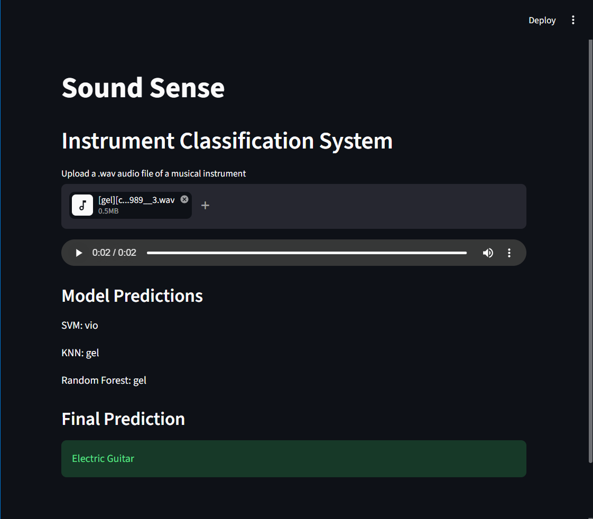

# Sound Sense 🎵

Sound Sense is an AI-powered musical instrument classification system that identifies the instrument being played from an uploaded WAV audio file.

## Dataset

* IRMAS (Instrument Recognition in Musical Audio Signals) Dataset

## Technologies Used

* Python
* Librosa
* NumPy
* Pandas
* Scikit-Learn
* Streamlit

## How It Works

1. User uploads an audio file.
2. Audio features such as MFCCs, Spectral Centroid, Bandwidth, Rolloff, RMS, Zero Crossing Rate, and Spectral Contrast are extracted using Librosa.
3. The extracted features are analyzed using:

   * Support Vector Machine (SVM)
   * K-Nearest Neighbors (KNN)
   * Random Forest
4. Ensemble voting is used to generate the final prediction.

## Supported Instruments

* Piano
* Violin
* Flute
* Clarinet
* Saxophone
* Trumpet
* Organ
* Acoustic Guitar
* Electric Guitar
* Cello
* Voice

## Application Preview

